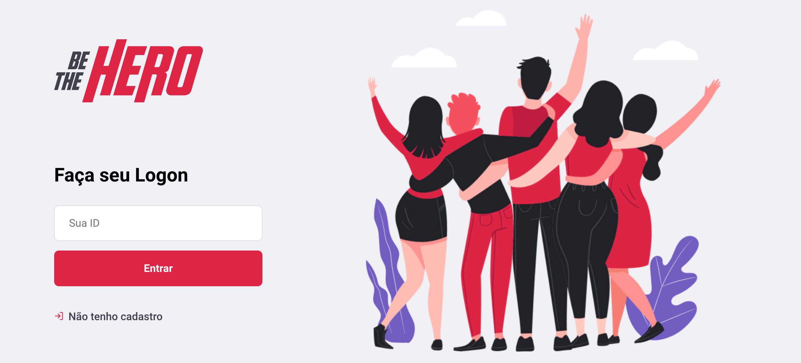
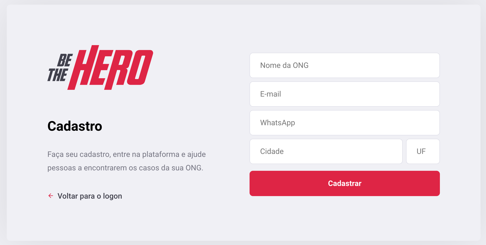
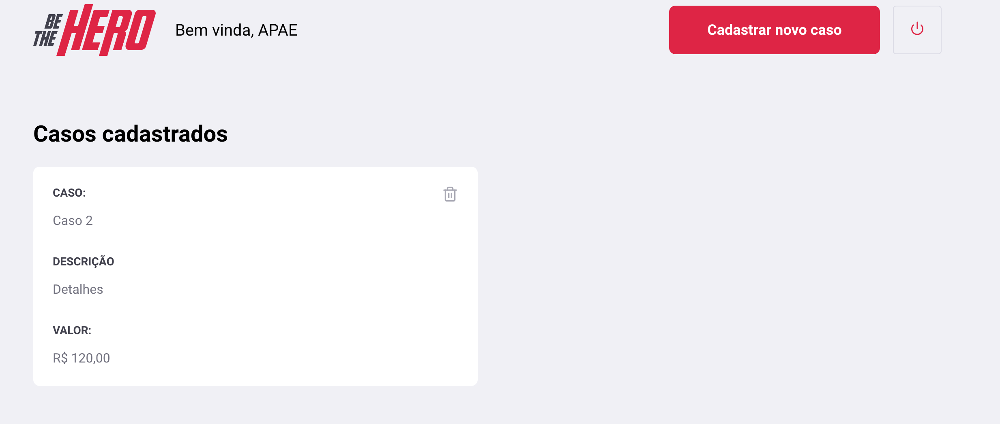
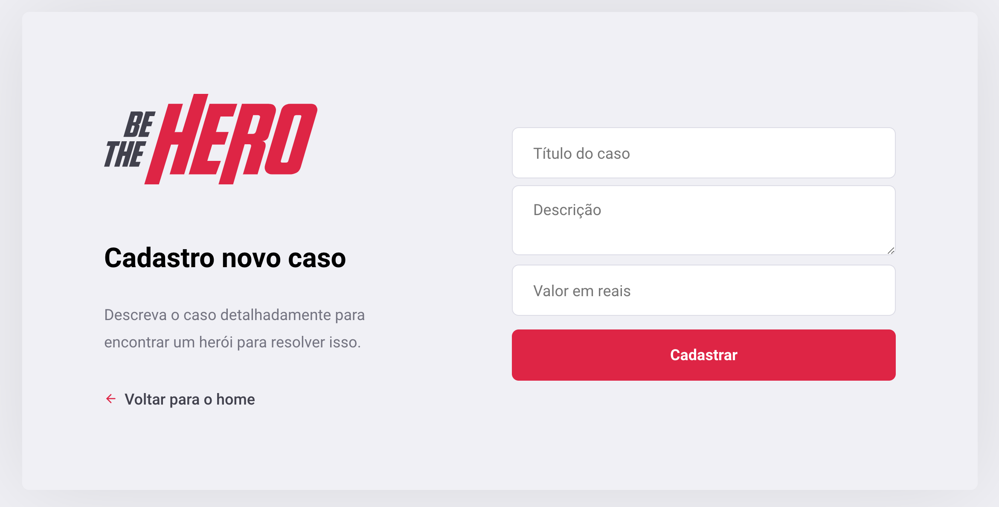

<h1 align="center">
<br>
  
<br>
<br>
Be The Hero
</h1>

<h4 align="center">Be the Hero is a project that aims to help, in a financial way, a charity, helping it to maintain itself. Non-governmental organizations (NGOs) are private, non-profit civil society entities whose purpose is to defend and promote a cause. This cause can be of virtually any type: human rights, animal rights, indigenous rights, gender, the fight against racism, the environment, urban issues, immigrants, among many others.</h4>

<p align="center">
  <a href="http://makeapullrequest.com">
    
  </a>
  <a href="https://opensource.org/licenses/MIT">
    
  </a>
</p>

<p align="center">
  <a href="#rocket-technologies">Technologies</a>&nbsp;&nbsp;&nbsp;|&nbsp;&nbsp;&nbsp;
  <a href="#getting-started">Getting started</a>&nbsp;&nbsp;&nbsp;|&nbsp;&nbsp;&nbsp;
  <a href="#contributing">Contributing</a>&nbsp;&nbsp;&nbsp;|&nbsp;&nbsp;&nbsp;
  <a href="#license">License</a>
</p>

<p align="center">
 
  <br>
  
  <br>
  
  <br>
  
  <br>
</p>

## :rocket: Technologies

This project was developed at the [Rocketseat OmniStack]() with the following technologies:

- [ReactJS](https://reactjs.org/)
- [Create React App Configuration Override](https://github.com/sharegate/craco)
- [React Router](https://github.com/ReactTraining/react-router)
- [styled-components](https://www.styled-components.com/)
- [Axios](https://github.com/axios/axios)
- [React-Icons](http://react-icons.github.io/react-icons/)
- [VS Code](https://code.visualstudio.com) with [ESLint](https://marketplace.visualstudio.com/items?itemName=dbaeumer.vscode-eslint)

## Getting started

To clone and run this application, you'll need [Git](https://git-scm.com), [Node.js v10.16](https://nodejs.org/en/) or higher + [Yarn v1.13](https://yarnpkg.com/) or higher installed on your computer and the [Be The Hero API](https://github.com/joaoathaide/bethehero-api-server). From your command line:

```bash
# Clone this repository
$ git clone https://github.com/joaoathaide/bethehero-web.git

# Go into the repository
$ cd bethehero-web

# Install dependencies
$ yarn

# Run the app
$ yarn start
```

## Contributing

Please read [CONTRIBUTING.md](CONTRIBUTING.md) for details on our code of conduct, and the process for submitting pull requests.

## License

This project is licensed under the MIT License - see the [LICENSE.md](LICENSE.md) file for details.

Made with ♥ by João Athaide
